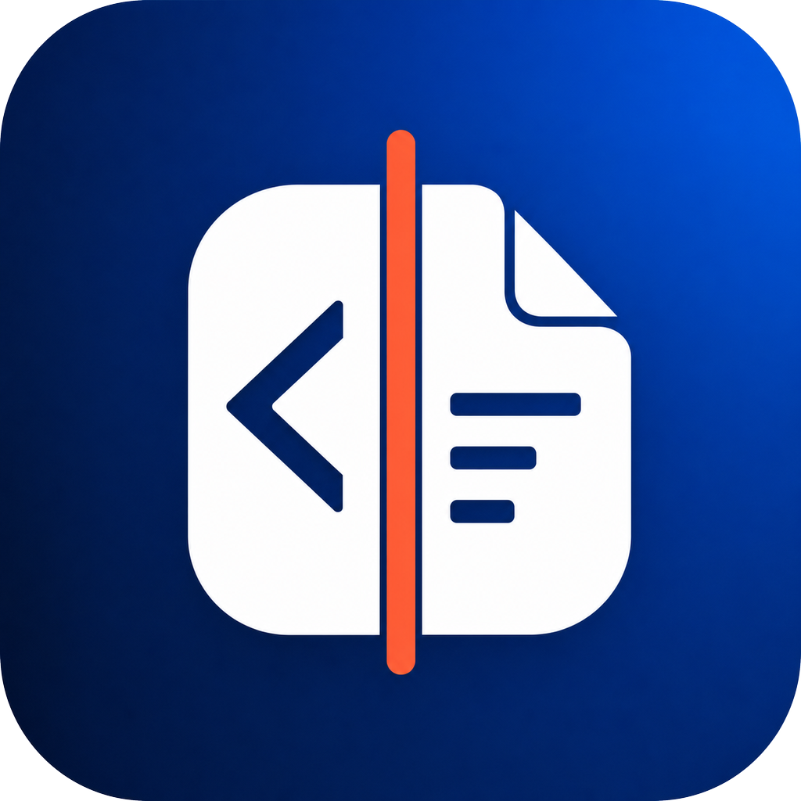

# HTML Studio



面向 macOS 与 Windows 的本地 HTML 源码和所见即所得编辑器。可在左侧编辑代码，也可像 Word 一样在右侧直接编辑页面，并导出 Markdown、Word 和 PDF。

A local-first HTML source and visual editor for macOS and Windows, with Markdown, DOCX and PDF export.

[下载 v0.3.9](https://github.com/J0SHY1X/html-studio/releases/tag/v0.3.9) · [MIT 许可证](LICENSE) · [贡献指南](CONTRIBUTING.md)

## 功能

- 源码/可视化双向同步，多文档标签页与实时预览。
- 中文输入法组合输入保护，撤销/重做、普通粘贴和纯文本粘贴。
- 在源码或可视化页面中查找、循环定位、区分大小写、替换当前或全部替换。
- Word 式字体、字号、字形、文字颜色、背景颜色、段落、列表和表格工具。
- 源码与页面右键菜单；复制页面格式、追加空白页和页码调整。
- 保存 HTML，导出 Markdown、DOCX、分页 PDF，以及系统打印。
- 本地自动草稿、修改日志、完整 HTML 快照和历史恢复。
- Windows 启动时显示可关闭的使用说明标签页。

本项目包含两个独立实现，不是同一个跨平台二进制：

| 目录 | 技术栈 | 目标 |
| --- | --- | --- |
| [macos](macos/README.md) | Swift / SwiftUI / AppKit / WebKit | macOS 13+；预编译包为 Apple Silicon |
| [windows](windows/README.md) | Electron / JavaScript / HTML / CSS | Windows 10/11 x64 |

## 安装

从 [Releases](https://github.com/J0SHY1X/html-studio/releases) 下载系统对应的 ZIP，并对照同页 `SHA256SUMS.txt` 校验。

- **Mac**：解压，将 `HTML Studio.app` 拖入“应用程序”。本版为本地临时签名，未经 Apple 公证，首次启动可能需要在 Finder 中右键选择“打开”。优先传输 ZIP，避免同步盘为 `.app` 添加扩展属性。
- **Windows**：完整解压便携 ZIP，再运行目录中的 `HTML Studio.exe`。不能只复制 EXE，也不能从 ZIP 预览窗口直接运行。本版未使用 Authenticode 证书，可能出现 SmartScreen 未知发布者提示。

## 从源码运行与构建

### macOS

需要 macOS 13+ 与 Xcode/Command Line Tools（Swift 5.9+）。

```sh
git clone https://github.com/J0SHY1X/html-studio.git
cd html-studio/macos
swift run HTMLStudio
swift run HTMLStudioSmokeTests
./scripts/build_app.sh
```

构建结果在 `macos/dist/`，包含 `.app` 和版本化 ZIP。脚本使用当前选择的 macOS SDK；可通过 `SDKROOT` 显式覆盖。

Pandoc 为可选工具：检测到本机安装时，Mac 版会用于文档转换；打开 DOCX 当前需要 Pandoc，无 Pandoc 时仍可使用基础导出功能。

### Windows

需要 Windows 10/11 x64、Git 和 Node.js 22.12+。

```powershell
git clone https://github.com/J0SHY1X/html-studio.git
cd html-studio/windows
npm ci
npm test
npm start
```

构建免安装目录：

```powershell
npm run pack:win
npm run portable:folder
```

先生成 `dist/win-unpacked`，再生成版本化便携目录。首次构建需要联网获取 Electron/构建工具。需要安装程序或单文件 Portable EXE 时，使用 `npm run dist:win`。

## 隐私与安全

草稿和历史保存在本机，不随本仓库上传。日志可能包含完整文档内容，提交问题时请使用虚构样例，并去除个人资料、文件路径、密钥和客户内容。

HTML 外部图片、样式等资源可能发起网络请求；Mac 的“交互预览”还允许页面脚本运行。因此，“本地编辑”不代表任意打开的网页都完全离线或可信。详细边界见 [SECURITY.md](SECURITY.md)。

## 当前边界

- 0.3.x 为早期版本；复杂网页、CSS 布局和导出格式之间不保证像素级一致。
- Windows 版不提供 DOCX 导入；Mac 的 DOCX 导入依赖 Pandoc。
- 预编译 Mac 版仅为 arm64；Intel/Universal 需自行构建并验证。
- 自动化测试不代替实际中文输入法、系统打印机和剪贴板的交互测试。
- 用户文档、历史日志、私有 QA 材料、依赖缓存和旧发布包不进入 Git 历史。

## 开源

项目源码采用 [MIT License](LICENSE)。第三方组件分别遵循其原有许可证，见 [THIRD_PARTY_NOTICES.md](THIRD_PARTY_NOTICES.md)。欢迎通过 Issues 和 Pull Requests 提交最小复现、改进建议及补丁。
